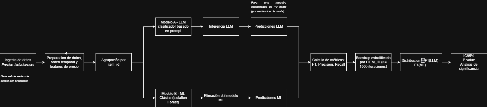
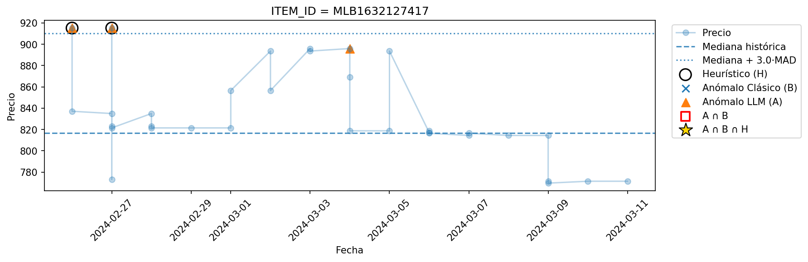
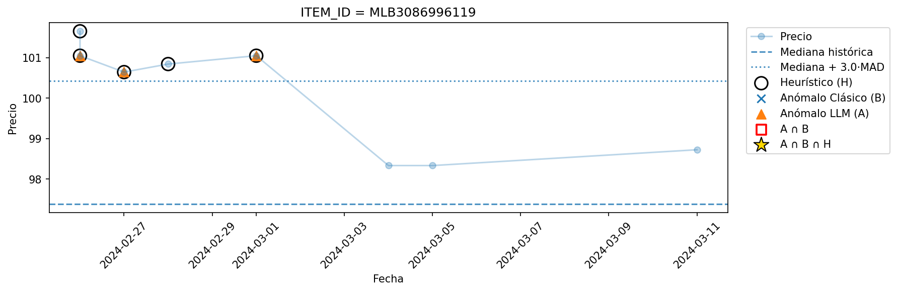
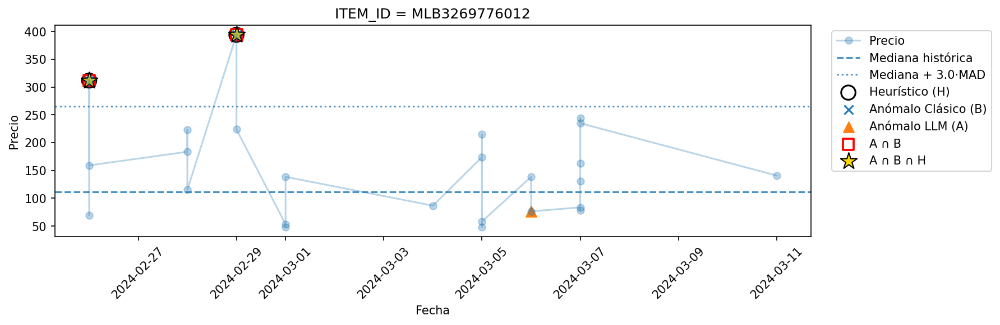
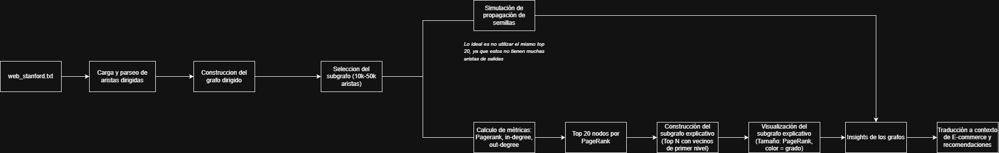
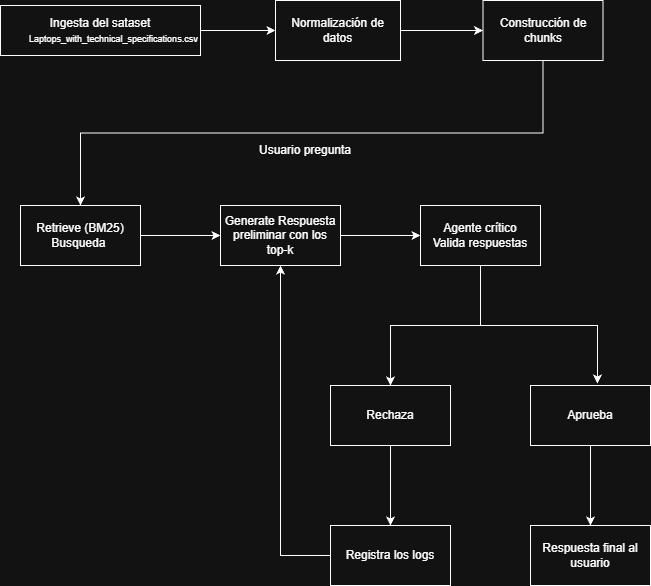

# Ejercicio 1 — ML vs LLM: detección de anomalías de precio

En este notebook se implemento y comparo dos enfoques para detectar anomalías de precio en un dataset de series de precios por producto.

## Objetivo
Detectar las anomalias de precios en un dataset de series de precios por producto.

## 1. Diseño



## 2. Práctica
Notebook, que incluye:
- Preparación de datos (prep)
- Modelo A (LLM)
- Modelo B
- Evaluación y tests estadísticos
- Ver archivo `ej1_lm_vs_llm.ipynb`.

3. Outputs

Tabla comparativa:


| Modelo          | F1         | Precision  | Recall     | PR-AUC     |
| --------------- | ---------- | ---------- | ---------- | ---------- |
| **A — LLM**     | **0.85** | 0.73   | **1.0** | 0.37     |
| **B — IForest** | 0.62     | **0.75** | 0.52    | **0.85** |

### A/B Test (ΔF1 = F1(LLM) − F1(IForest))

| Estadístico   | Valor            |
| ------------- | ---------------- |
| **ΔF1 medio** | **0.24**       |
| **IC95%**     | [0.0048, 0.5412] |
| **p-value**   | 0.0420           |

La latencia del modelo LLM fue de 616.88 ms/llamada y el ML de 0,00364 ms/fila


## 3. Graficos







## 4. Conclusión ejecutiva

El LLM supera al modelo clásico en F1 con una diferencia estadísticamente significativa (p < 0.05) y una mejora media de 0,25. El LLM ofrece recall de 1, lo que reduce los Falsos Positivos en casos críticos. Sin embargo el modelo ML presenta una latencia mucho menor, lo que lo hace más eficiente para inferencia en tiempo real. 

Como nuestro caso es priorizar la detección de anomalias, el LLM es la mejor opción, pero si tenemos limitantes en costos y tiempo, el modelo clásico tambien es una opción viable.


# Ejercicio 2 — Grafos

## Objetivo
Modelar la circulación de información mediante enlaces y estimar autoridad/influencia de URLs.

## 1. Diseño




## 2. Práctica
Notebook, que incluye:
- Calculo de metricas
- Ranking top 20 nodos
- Visualizacion del subgrafo
- Ver archivo `ej2_grafos.ipynb`.
- Grafico interactivo del subgrafo ubicado en `visualizations/ej2_grafos.html`


## 3. Recomendaciones Practicas para un E-commerce estrategico

Teniendo cómo objetivo aumentar la autoridad y visibilidad de las paginas clave de negocio (categorias y productos estrategicos).

- Crear paginas "autoridad" bien enlazadas. Imitar nodos como 226411  (con las categorias claves), el cual recibe muchos enlaces y se vuelven muy influyentes. asegurando que esten enlazadas desde el menu principal y el footer, para lograr mayor autoridad y visibilidad.

- Construir "racismo" de contenido al rededor de productos importantes. Por ejemplo en el grafo se tenian nodos azules que rodeaban nodos rojos, haciendo por ejemplo que los nodos rojos sean los productos estrellas y los nodos que los rodean contenidos de apoyo (guias, reseñas, comparativos, etc), esto con el fin de que el productos estrella reciba enlaces relevantes.

- Reducir paginas huerfanas, en el grafo, los nodos con pocos enlaces entrantes casi no tienen PageRank; son poco visibles.

# Ejercicio 3  — RAG + Agente

## Objetivo
Construir un sistema RAG que responda preguntas sobre laptops. Debe recuperar chunks/pasajes relevantes y generar respuestas con citas. Incluir al menos un agente (p. ej., agente crítico) que verifique que cada afirmación esté respaldada por los chunks/pasajes.

## 1. Diseño



## 2. Práctica
Notebook, que incluye:
- Carga y normalizacion 
- Construccion de chunk
- Construccion de index
- Retrieve chunks
- Generate - respuesta preliminar
- Agente critico y logs

- Ver archivo `ej3_rag_agente.ipynb`.


# Como ejecutar los ejercicios

1. Descargar el dataset correspondiente al ejercicio y colocsarlo en `data/web-Stanford.txt`

2. Instalar dependencias:

```bash
pip install -r requirements.txt
```

3. Ejecutar el notebook:

* para el ejercicio 1:

*El ejercicio 1 requiere el API KEY de Gemini*

```bash
jupyter notebook ej1_lm_vs_llm.ipynb
```

* para el ejercicio 2:

```bash
jupyter notebook ej2_grafos.ipynb
```

* Para el ejercicio 3:

```bash
jupyter notebook ej3_rag_agente.ipynb
```

Instalar dependencias:

```bash
pip install -r requirements.txt
```
